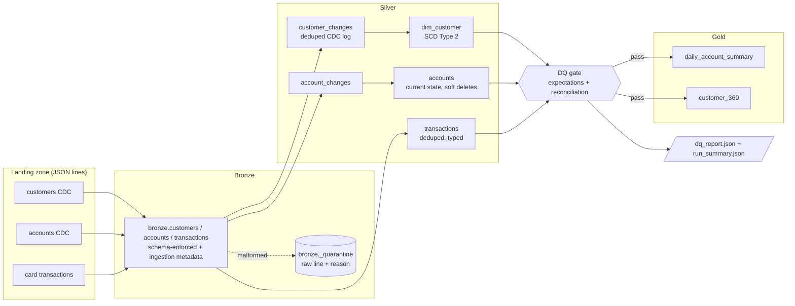

# Lakehouse Medallion Pipeline

[](https://github.com/veeranjanreddy-86/lakehouse-medallion-pipeline/actions/workflows/ci.yml)


A bronze → silver → gold lakehouse pipeline in **PySpark** (optionally on **Delta Lake**)
for banking change-data-capture (CDC) feeds. It includes an **SCD Type 2** customer
dimension, handling for late and duplicate events, lightweight **data-quality
expectations** with a JSON report, and a **pytest** suite that runs on local Spark.

> Representative portfolio project built on synthetic data; not affiliated with or derived from any employer's code or data.

---

## Business problem

Analytics and ML feature pipelines need an accurate answer to *"what did we know about
this customer at time T?"* (risk rating, segment, address) and trustworthy balances.
Upstream CDC feeds make that hard:

- events arrive **out of order** and **late** (a Jan 5 update can arrive after Jan 10's),
- the same event is **re-delivered** (at-least-once delivery),
- some records are **malformed** (truncated JSON, wrong types, missing keys),
- deletes must not destroy history (regulatory look-back, model back-testing).

This pipeline turns that feed into:

- a **point-in-time correct history** (SCD2),
- **reconciled** fact tables,
- **gold** tables for reporting and ML features.

Every run is checked by data-quality gates.

## Architecture



| Layer | Module | What it does |
|---|---|---|
| Generate | `generate.py` | Seeded synthetic CDC feed (customers, accounts, card transactions) delivered in micro-batch files. Includes ~3–5% late events, ~3% duplicates, malformed lines and formatting noise. |
| Bronze | `bronze.py` | Reads JSON lines and parses them against an explicit contract (`schemas.py`). Unknown fields are dropped. Malformed JSON, type mismatches, missing required fields, unknown `op` codes and unparseable timestamps go to **quarantine** with the raw line and a reason. Adds `_source_file`, `_ingest_run_id` and `_ingested_at`. Each file is ingested **once**. |
| Silver | `silver.py` | Normalises types, mixed timestamp formats, casing and e-mails. Deduplicates by event/txn id. Builds an append-only **change log** per entity, then derives `dim_customer` (**SCD2**) and `accounts` (SCD1, soft deletes) by rebuilding only the **affected keys**. |
| Gold | `gold.py` | `daily_account_summary`: counts, credits, debits, net and running balance per account per day. `customer_360`: current profile, history depth, portfolio, balances, spend and top merchant category. |
| Quality | `quality.py` | `not_null`, `unique` (optionally filtered), `accepted_values`, SQL expression checks, bronze→silver **row-count reconciliation** and a quarantine-ratio check. Each check has an `error` or `warn` severity. In `fail` mode the run raises after the report is written. |
| Orchestration | `pipeline.py` | Runs bronze → silver → **DQ gate** → gold → DQ, then writes the reports. Configured by `conf/pipeline.toml` plus CLI overrides. |

## Quickstart

Requires Python 3.11 and a JDK (CI uses Java 17; also verified locally on Java 21).

```bash
make install        # .venv + pyspark, delta-spark, pytest, ruff
make generate       # synthetic landing files -> data/landing (seed 42)
make run            # bronze/silver/gold -> data/lakehouse (Parquet)
make rerun          # idempotency: no new files -> no changes
make test           # pytest on local Spark
make lint
```

You can also call the modules directly:

```bash
python -m lakehouse.generate --out data/landing --customers 200 --days 30 --batches 3
python -m lakehouse.pipeline --config conf/pipeline.toml [--format delta] [--dq-mode warn]
```

Or use Docker (non-root user, OpenJDK 17): `make docker-build && make docker-run`.

### Parquet by default, Delta optional

`delta-spark` fetches its JARs from Maven Central the first time a session starts. So
that the project runs (and tests pass) **fully offline**, the default storage format is
**Parquet**. All merge logic is written as plain DataFrame operations, so nothing
depends on Delta's `MERGE`.

- `--format delta` switches every table to Delta Lake. This needs Maven access, or set
  `LAKEHOUSE_SPARK_JARS` to local `delta-spark_2.12-3.2.1.jar` and
  `delta-storage-3.2.1.jar` paths. If the JARs cannot be resolved, the pipeline stops
  with a clear message instead of a JVM stack trace.
- In Parquet mode, overwrites write to a staging directory and then swap it in, so
  readers never see a half-written table. Delta gets the same guarantee from its
  transaction log.
- `databricks/` shows how the "replace affected keys" step becomes `MERGE INTO` /
  `APPLY CHANGES` on Databricks.

## Results from a real run

From `make generate && make run` (seed 42, 200 customers, 30 days, 3 batches, local[2]
on a laptop-class VM, ~40 s end to end):

| Table | Rows | Notes |
|---|---:|---|
| bronze.customers | 428 | 437 lines read, 9 quarantined |
| bronze.accounts | 407 | 416 read, 9 quarantined |
| bronze.transactions | 4,933 | 4,942 read, 9 quarantined |
| silver.customer_changes | 411 | 17 duplicate deliveries removed |
| silver.dim_customer | 411 | 200 customers: 76 / 62 / 37 / 25 have 1 / 2 / 3 / 4 versions; 11 soft-deleted |
| silver.accounts | 312 | 279 active, 32 closed, 1 frozen |
| silver.transactions | 4,769 | 164 duplicates removed, 156 late arrivals placed by event time |
| gold.daily_account_summary | 3,747 | `sum(txn_count)` reconciles to 4,769 |
| gold.customer_360 | 200 | one row per current customer |

A second `make run` ingested 0 files, skipped all silver builds and produced the
same table counts and contents (tested in `test_pipeline.py`).

Quarantine breakdown: `malformed_json_or_type_mismatch` 9, `missing_required:*` 8,
`invalid_op` 5, `invalid_timestamp` 5.

Example SCD2 history (`silver.dim_customer`, customer `C00012`):

| city | segment | risk_rating | effective_from | effective_to | is_current |
|---|---|---|---|---|---|
| Hillcrest | SMALL_BUSINESS | HIGH | 2026-01-04 16:41:28 | 2026-01-19 05:57:00 | false |
| Hillcrest | PRIVATE | HIGH | 2026-01-19 05:57:00 | 2026-01-27 23:01:46 | false |
| Hillcrest | SMALL_BUSINESS | HIGH | 2026-01-27 23:01:46 | 9999-12-31 23:59:59 | true |

### Sample DQ report

`data/lakehouse/_reports/dq_report_latest.json` (abridged). The two `WARN`s are
intentional: the generator injects 3 malformed lines per file, which is just over the
2% quarantine threshold for the smaller CDC feeds.

```json
{
  "run_id": "20261007T165704Z-c4d767",
  "mode": "fail",
  "summary": { "total": 33, "passed": 31, "warned": 2, "failed": 0 },
  "results": [
    { "table": "bronze.customers", "check": "quarantine_ratio <= 2.00%", "severity": "warn",
      "status": "WARN", "observed": { "numerator": 9, "denominator": 437, "ratio": 0.02059 } },
    { "table": "silver.transactions", "check": "row_count_reconciliation(bronze distinct txn_id)",
      "severity": "error", "status": "PASS",
      "observed": { "expected": 4769, "actual": 4769, "difference": 0, "tolerance": 0.0 } },
    { "table": "silver.dim_customer", "check": "unique(customer_id) where is_current",
      "severity": "error", "status": "PASS", "observed": { "duplicate_keys": 0, "sample": [] } },
    { "table": "silver.dim_customer",
      "check": "contiguous_history: (_next_from IS NULL AND is_current) OR (_next_from = effective_to AND NOT is_current)",
      "severity": "error", "status": "PASS", "observed": { "violations": 0 } },
    { "table": "gold.daily_account_summary", "check": "row_count_reconciliation(sum(txn_count) vs silver.transactions)",
      "severity": "error", "status": "PASS", "observed": { "expected": 4769, "actual": 4769, "difference": 0 } }
  ]
}
```

## Test strategy

The tests use a session-scoped local `SparkSession` (`local[2]`, 2 shuffle partitions,
no UI, UTC). Each test gets its own temporary lake. There are 25 tests and they take
about 3 minutes.

| File | Covers |
|---|---|
| `test_bronze.py` | Schema enforcement: unknown fields dropped, `op` case-normalised. Every quarantine reason. Type mismatch keeps the raw line. Re-ingesting the same file is a no-op. New files are picked up incrementally. |
| `test_silver.py` | Deterministic dedupe. Current state ordered by event time, not arrival. A late older event cannot regress state across runs. Soft delete keeps attributes. Transaction typing, signing, timestamp formats and cross-file dedupe. |
| `test_scd2.py` | History rows and `effective_to` chaining. Exactly one current row per key. Input order does not change the result. Soft delete, then reactivation. No-op compression. A late event is inserted mid-history incrementally. A late event between two identical versions is not lost. |
| `test_gold.py` | Hand-computed fixture: daily totals, running balance, 360 portfolio/balance/spend/top category. |
| `test_quality.py` | Every expectation fails on bad data and passes on good data. `fail` vs `warn` modes. JSON report contents. The pipeline's **DQ gate blocks gold** on bad silver. |
| `test_pipeline.py` | End to end on generated data. **Idempotent re-run** (identical tables). **Batch-by-batch delivery produces the same silver and gold as one big batch.** |

## Design decisions

**SCD2 is derived from a change log.** Silver keeps an append-only, deduplicated
change log as the source of truth. When new events arrive, only the affected
`customer_id`s are rebuilt from their full change history:

1. order by `event_ts`, breaking ties on `event_id`;
2. forward-fill attributes, so deletes keep the last known image;
3. compress no-op versions;
4. chain `effective_to` to the next version's `effective_from`, with `9999-12-31` for
   the open version.

The rebuilt keys are then swapped in. Patching the dimension in place is the usual
alternative, but it breaks under late data: if X@t1 and X@t3 were compressed into
one version and Y@t2 arrives late, the correct history is X, Y, X. You can only
recover that from the raw changes, and `test_scd2.py` covers this case.

**Late and out-of-order data.** Event time always decides; arrival order never does.
Silver dimensions are rebuilt per key, so a late event lands in the right place in the
history and the neighbouring versions are re-closed. Gold is fully recomputed from
silver, so late transactions flow into running balances automatically.

**Idempotency has several layers:**

- the bronze ingestion log works at file level;
- silver keeps a checkpoint of processed bronze runs;
- silver also anti-joins on `event_id` / `txn_id`, so a replayed run cannot create
  duplicates;
- the per-key rebuild is deterministic;
- gold is recomputed from silver.

The ingestion log is written after a successful append. If a crash happens between
the two, bronze may re-append that file, and silver's id dedupe absorbs it.

**Soft deletes.** A `D` event closes the previous version and opens a version with
`is_deleted = true`. History is never physically removed. A later `I` reactivates the
customer.

**DQ gate before publish.** Silver checks run before gold is built. In `fail` mode an
`error` check stops the run before gold is published, and the report is always
written.

## Limitations

- Paths are local or FUSE-mounted filesystem paths. The Parquet staging swap relies on
  directory renames, which are not atomic on object stores; use `--format delta`
  there.
- Silver DQ runs after the silver write. A failure blocks gold, but silver already
  holds the new data. A full write-audit-publish flow (Delta branches or shallow
  clones) is not implemented.
- The per-key SCD2 rebuild reads the full change history of every affected key. That
  is fine for dimensions, but very hot keys would need partitioned or bounded history.
- Gold is fully recomputed on every run, which is simple but O(silver).
- Schema evolution is limited to dropping unknown fields. Drift is not reported.
- The DQ framework is deliberately small. It is not a replacement for Great
  Expectations, Soda or DLT expectations.
- Single currency (USD). The `closing_balance` running ledger starts at 0 when the
  account opens.
- `--format delta` was not run in the build environment (Maven blocked). The Delta
  code path is a thin switch in `storage.py` and `spark.py`.

## Roadmap

- [ ] **Delta Live Tables**: port the expectations to `@dlt.expect*` and SCD2 to
  `APPLY CHANGES ... STORED AS SCD TYPE 2` (mapping in [`databricks/`](databricks/README.md)).
- [ ] **Unity Catalog**: three-level names, column masks on PII (`email`), lineage.
- [ ] **Auto Loader** (`cloudFiles`) with `rescuedDataColumn` replacing the file-level
  ingestion log.
- [ ] **Structured Streaming** for bronze/silver with `foreachBatch` merges and
  watermark-bounded dedupe.
- [ ] Incremental gold: recompute only the affected `(account_id, txn_date)` slices.
- [ ] Write-audit-publish for silver; DQ metrics trend dashboard.

## Repository layout

```
src/lakehouse/   config, spark, storage, schemas, generate, bronze, silver, gold, quality, pipeline
tests/           pytest suite (local Spark)
conf/            pipeline.toml
databricks/      Workflows / DLT mapping + example Asset Bundle (illustrative)
```

## License

[MIT](LICENSE) © 2026 Veeranjan Reddy
